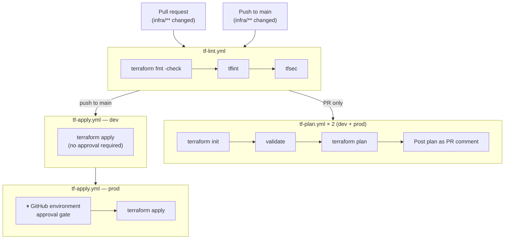

# iac-pipeline-template

A reusable IaC baseline for AWS Terraform projects. Contains:

- **Reusable GitHub Actions workflows** — lint/security scan, plan-with-PR-comment, and apply with a required prod approval gate. Projects call these workflows by reference — pipeline logic lives here, not duplicated per project.
- **Bootstrap module** — provisions the S3 remote state bucket and GitHub Actions IAM role (OIDC, no stored credentials) for a new project. State locking is handled natively by S3 via `use_lockfile = true`.
- **Scaffolding** — `infra/envs/dev` and `infra/envs/prod` stubs, a module skeleton, `.gitignore`, and `.tflint.hcl` ready to go.

## Pipeline architecture



## Using this as a GitHub template

1. Click **Use this template** → **Create a new repository** on this repo's GitHub page.
2. Clone your new repo and work through the [New project setup checklist](#new-project-setup-checklist) below.

## New project setup checklist

### 1. Bootstrap remote state and OIDC (one-time per project)

```bash
cd bootstrap
```

Edit `variables.tf` defaults (or pass via `-var`):

| Variable | What to set |
|---|---|
| `project_name` | Your project name, e.g. `my-project` |
| `github_org` | Your GitHub username or org |
| `github_repo` | The new repo name |
| `create_oidc_provider` | `false` if you already have the GitHub OIDC provider in this AWS account |

Then:

```bash
terraform init
terraform apply
```

Note the outputs — you need them in the next steps:

```
tf_state_bucket          = "my-project-tfstate-123456789012"
github_actions_role_arn  = "arn:aws:iam::123456789012:role/my-project-github-actions"
```

> If `create_oidc_provider = false`, import the existing provider first:
> ```bash
> terraform import aws_iam_openid_connect_provider.github <existing-arn>
> ```

### 2. Update backend configuration

Paste the `tf_state_bucket` output into both `infra/envs/dev/backend.tf` and `infra/envs/prod/backend.tf`, replacing the `REPLACE-ME` placeholder.

### 3. Update tfvars

Set `project_name` in `infra/envs/dev/terraform.tfvars` and `infra/envs/prod/terraform.tfvars`.

### 4. Set GitHub repository secrets

In your new repo → **Settings → Secrets and variables → Actions**:

| Secret | Value |
|---|---|
| `AWS_ROLE_ARN` | The `github_actions_role_arn` output from bootstrap |
| `TF_VARS` | JSON object of your Terraform variables (see below) |

**`TF_VARS` format:**

```json
{"alarm_email": "you@example.com", "other_var": "value"}
```

Each key becomes a `TF_VAR_<key>` environment variable during plan and apply. If your project has no `terraform` input variables that need secrets, you can omit `TF_VARS` entirely.

### 5. Create GitHub environments

In your new repo → **Settings → Environments**, create two environments:

- `dev` — no protection rules required
- `prod` — add **Required reviewers** (yourself) to enforce the approval gate

### 6. Copy the caller workflow

Copy `.github/workflows/terraform.yml` from this repo into your new project's `.github/workflows/terraform.yml`. It already references the reusable workflows here — no changes needed unless you want to override `tf_version` or `aws_region`.

### 7. Add your modules

Rename or copy `infra/modules/_example/` as a starting point for each module. Wire modules into `infra/envs/dev/main.tf` and `infra/envs/prod/main.tf`.

## Reusable workflow reference

All three workflows live in `.github/workflows/` and are called with `uses: Bzahirpour/iac-pipeline-template/.github/workflows/<file>@main`.

### `tf-lint.yml`

| Input | Type | Default | Description |
|---|---|---|---|
| `tf_version` | string | `1.14.8` | Terraform version |
| `tflint_version` | string | `v0.50.3` | tflint version |
| `working_directory` | string | `infra` | Directory for fmt check and tflint |

### `tf-plan.yml`

| Input | Type | Required | Description |
|---|---|---|---|
| `environment` | string | yes | Label shown in PR comment (`dev`, `prod`) |
| `working_directory` | string | yes | Path to the env workspace |
| `aws_region` | string | no | Default `us-east-1` |
| `tf_version` | string | no | Default `1.14.8` |

| Secret | Required | Description |
|---|---|---|
| `aws_role_arn` | yes | IAM role assumed via OIDC |
| `tf_vars` | no | JSON object of Terraform variable values |

### `tf-apply.yml`

Same inputs and secrets as `tf-plan.yml`, plus:

| Input | Type | Required | Description |
|---|---|---|---|
| `github_environment` | string | yes | GitHub environment name for the approval gate |

## Scope down the IAM role

The bootstrap attaches `AdministratorAccess` for simplicity. Once you know which AWS services your project uses, replace it with a least-privilege policy in `bootstrap/main.tf`:

```hcl
resource "aws_iam_role_policy_attachment" "github_actions_admin" {
  role       = aws_iam_role.github_actions.name
  policy_arn = "arn:aws:iam::aws:policy/AdministratorAccess"  # replace this
}
```
