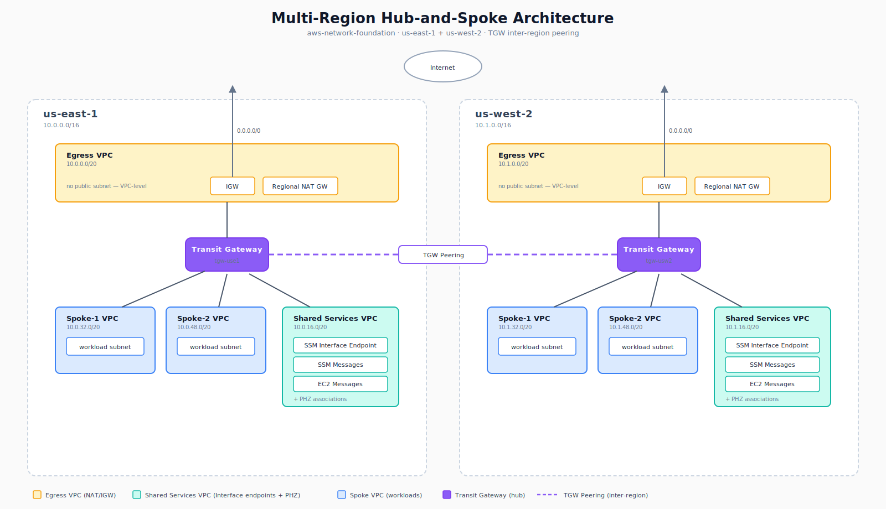
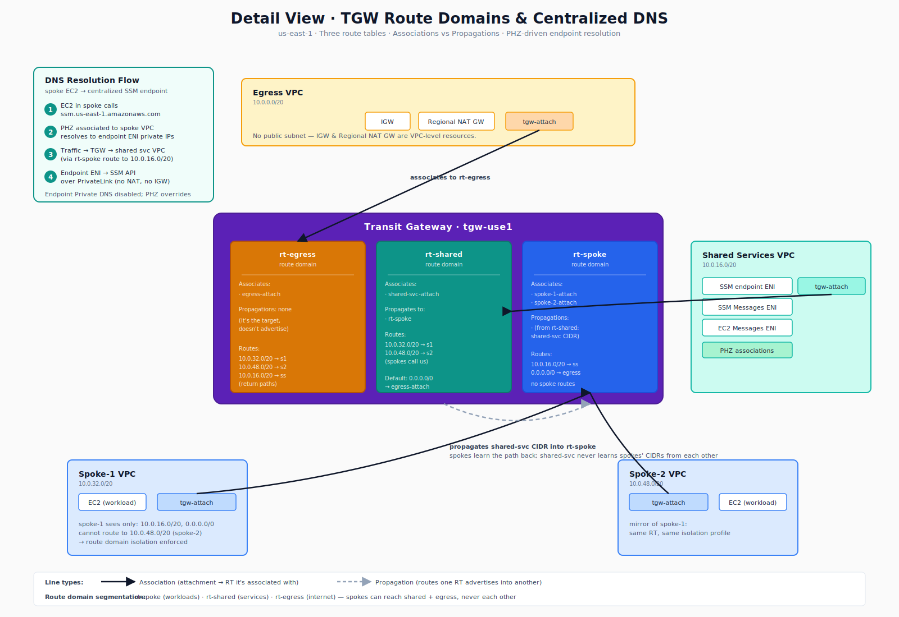

# aws-network-mrhs

A multi-region AWS hub-and-spoke network built with Terraform — Transit Gateway, route-domain isolation, and centralized internet egress. Phase 1 (single region, single spoke) was built, applied, and validated on 2026-05-20, then destroyed for cost control. The IaC is re-deployable from `main` at any time, but nothing is currently running in AWS. That's intentional: it demonstrates cost-disciplined, idempotent infrastructure rather than infrastructure left idling. Bootstrapped from [iac-pipeline-template](https://github.com/Bzahirpour/iac-pipeline-template). Full design, CIDR plan, module contracts, and decisions log: see [docs/PLAN.md](docs/PLAN.md).

---

## Architecture





The diagrams show the Phase 1 deployed state, not the end-state multi-region design.

**Topology:** A Transit Gateway in `us-east-1` acts as the hub. Three segmented route tables (`rt-spoke`, `rt-shared`, `rt-egress`) enforce route-domain isolation: spoke VPCs associate to `rt-spoke` and propagate into `rt-egress`, but do not propagate between each other. Internet egress flows `spoke → TGW → egress VPC → Regional NAT Gateway → IGW`. The Regional NAT Gateway is a VPC-level resource (`availability_mode = "regional"`) that expands across AZs automatically and requires no public subnet — its AWS-managed route table handles the IGW leg; return routes for each spoke CIDR must be added explicitly as `aws_route` resources targeting the TGW attachment.

---

## Repository layout

```
infra/
  modules/
    vpc/               # Generic VPC primitive (subnets, IGW, Regional NAT GW, flow logs)
    tgw/               # Transit Gateway + named route tables
    tgw-attachment/    # Single VPC → TGW attachment with association + propagation control
  envs/
    dev/
      primary/         # us-east-1 composition (dev) — Phase 1 deployed here
    prod/
      primary/         # us-east-1 composition (prod) — scaffolded, not yet deployed
bootstrap/             # Provisions S3 state bucket + OIDC IAM role (one-time, local apply)
docs/
  PLAN.md              # Full design: CIDR plan, module contracts, phases, decisions log
  architecture-overview.svg
  architecture-detail.svg
.github/
  workflows/
    pr-checks.yml      # Lint → validate → plan → scan → infracost → comment + claude-review
    apply.yml          # plan-dev → apply-dev (gate) → plan-prod → apply-prod (gate)
```

Each directory under `envs/` is an independently planned and applied Terraform workspace with its own state key. Modules are pure primitives — no provider configuration, no backend. Future phases add `tgw-peering`, `endpoints-hub`, and `secondary`/`global` workspaces; see [docs/PLAN.md](docs/PLAN.md) for the full planned structure.

---

## CI/CD gate

Two workflows replaced the original `terraform.yml`:

### `pr-checks.yml` — every PR targeting `main` that touches `infra/**`

```
lint → validate (dev + prod) → plan (dev + prod) → scan (dev + prod)
                                                 ↘ infracost (dev + prod)
                                                       ↓
                                                    comment (sticky)
claude-review (independent lane)
```

| Job | What it does | Gates merge? |
|---|---|---|
| `lint` | `terraform fmt -check` + tflint | Yes |
| `validate` | `init -backend=false` + `validate` (no AWS creds) | Yes |
| `plan` | Full plan via OIDC; uploads plan.json + plan.txt as artifacts | Yes |
| `scan` | Trivy + Checkov against resolved `plan.json`; SARIF → Code Scanning | Yes (HIGH/CRITICAL) |
| `infracost` | Cost estimate from plan JSON | No |
| `comment` | Single sticky comment: plan + Trivy + Checkov + cost per env | No |
| `claude-review` | Claude posts its own security review comment | No |

### `apply.yml` — push to `main` that touches `infra/**`

```
plan-dev → apply-dev (env gate) → plan-prod → apply-prod (env gate)
```

Each apply job is gated by a GitHub Environment with required reviewers. Both dev and prod require approval. `concurrency: cancel-in-progress: false` ensures in-flight applies are never cancelled by a subsequent push.

> **Plan drift:** The plan shown in the PR comment is generated from the PR head commit. `apply.yml` re-plans from scratch at merge time. If another PR merged concurrently and changed shared state, the applied plan may differ from what was reviewed. The approval gate before each apply is the moment to catch this.

### Secrets required

| Secret | Used by | Notes |
|---|---|---|
| _(none — OIDC)_ | All AWS calls | Role assumed via `mrhs-github-actions` |
| `CLAUDE_API_KEY` | `claude-review` job | Anthropic API key |
| `INFRACOST_API_KEY` | `infracost` job | Free tier available at infracost.io |

---

## State and identity

State lives in S3 bucket `mrhs-tfstate-453624448159` (AWS account `453624448159`, region `us-east-1`) with native locking via `use_lockfile = true` (Terraform 1.10+, no DynamoDB table required). CI/CD authenticates to AWS exclusively via OIDC — the `mrhs-github-actions` IAM role is assumed at runtime; no static AWS credentials appear in workflow secrets. Provider versions: `hashicorp/aws ~> 6.0`, Terraform `~> 1.14`. The state bucket and OIDC role are provisioned by a one-time local `terraform apply` in `bootstrap/` — see [docs/PLAN.md](docs/PLAN.md) for details.

---

## Operate

Open a branch, make changes under `infra/`, and push a PR targeting `main`. The `pr-checks.yml` workflow runs automatically: lint gates immediately, then validate and plan run in parallel for dev and prod, then security scanners (Trivy and Checkov) and Infracost consume the resolved plan JSON, and finally a sticky PR comment posts the plan output, scan summaries, and cost estimate for both environments alongside a separate Claude security review comment. Once checks pass and the PR is approved, merge to `main`. The `apply.yml` workflow triggers, re-plans dev, pauses for a required reviewer to approve the GitHub Environment gate, applies dev, then re-plans prod, pauses for prod approval, and applies prod.

---

## Roadmap

- **Phase 1** ✅ Built, applied, and validated 2026-05-20, then destroyed for cost control. Single region (`us-east-1`), single spoke, centralized egress via Regional NAT Gateway.
- **Phase 2:** Second spoke + route-domain isolation (spoke-to-spoke traffic blocked at TGW route table level)
- **Phase 3:** Shared services VPC + centralized SSM Interface endpoints + Route 53 Private Hosted Zones
- **Phase 4:** Replicate to `us-west-2` — independent secondary stack with `10.1.x.x` CIDRs
- **Phase 5:** TGW inter-region peering + static routes in `envs/dev/global`
- **Phase 6:** README + diagram polish, module-level docs, cost summary from real `aws ce` data
- **Phase 7 (v2):** AWS IPAM migration — hierarchical pools replacing the hardcoded CIDR plan

Full design and decisions log: see [docs/PLAN.md](docs/PLAN.md).
